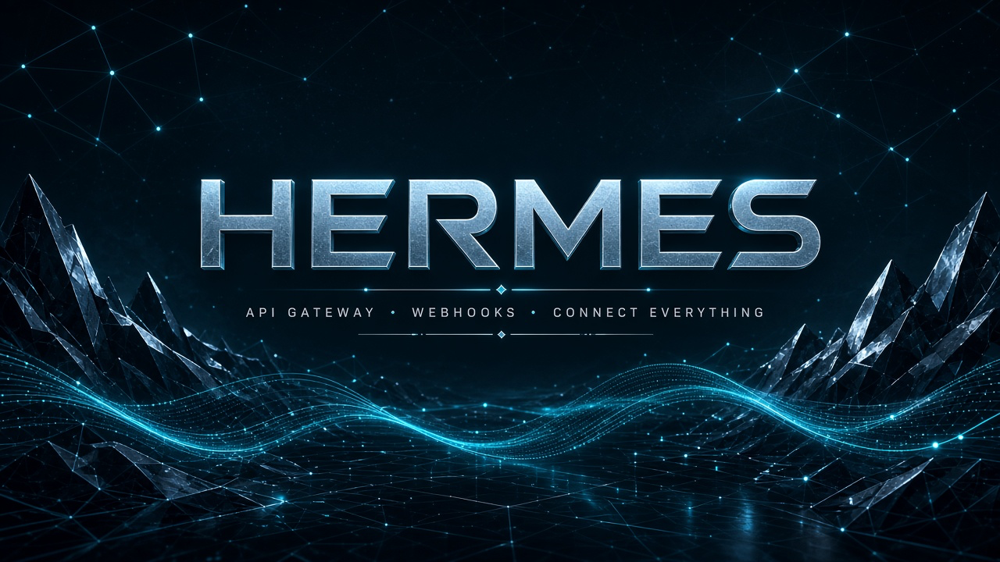

<p align="center">
  
</p>

<h1 align="center">Hermes</h1>

<p align="center">
  <strong>API Gateway · Webhooks · Futuristic Console</strong><br/>
  Route signals. Deliver webhooks. Stay in sync. — no login required.
</p>

<p align="center">
  <a href="http://localhost:3000">Console</a> ·
  <a href="http://localhost:3000/docs">Docs</a> ·
  <a href="http://localhost:4000/api/v1/openapi.json">OpenAPI</a> ·
  <a href="http://localhost:4000/health">Health</a>
</p>

<p align="center">
  
  
  
  
</p>

---

## Why Hermes

Hermes sits between producers and consumers: ingest webhooks, apply gateway middleware, fan-out with retries, and operate everything from a live console.

| | |
|---|---|
| **Gateway** | Request IDs, rate limits, echo proxy, OpenAPI |
| **Webhooks** | Subscriptions, HMAC, retries, dead-letter queue |
| **Console** | Live metrics, audit log, ingest playground — English UI, no auth |
| **Ops** | Disk persistence, Docker Compose, GitHub Actions CI |

## Quick start

```bash
npm install
npm run dev:gateway   # http://localhost:4000
npm run dev:web       # http://localhost:3000
```

Open **[http://localhost:3000](http://localhost:3000)** for the brand landing, then **[http://localhost:3000/console](http://localhost:3000/console)** for the control plane.

### Docker

```bash
docker compose up --build
```

## Stack

```
Hermes/
├── apps/gateway   # Express API Gateway + webhooks
├── apps/web       # Next.js console (Syne / Manrope, ice-chrome UI)
├── docs/          # README assets
└── docker-compose.yml
```

| Layer | Technology |
|-------|------------|
| Frontend | Next.js App Router |
| API | Express |
| Runtime | Node.js 22+ |
| Deploy | Docker Compose |

## Capabilities

- Versioned `/api/v1` gateway with request tracing
- Webhook create / patch / pause / delete + ingest fan-out
- Exponential backoff retries and dead-letter queue
- Per-source ingest rate limits + request audit log
- `/api/v1/metrics` and `/api/v1/openapi.json`
- Operator console tabs: Overview · Webhooks · Routes · Ops

## Tests

```bash
npm test
npm run build --workspace=@hermes/web
```

## License

MIT
